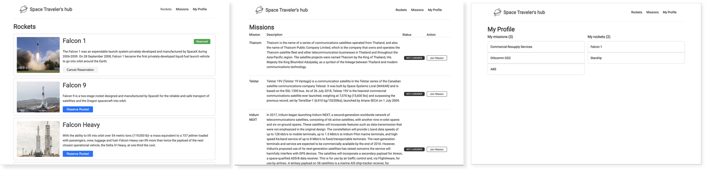

# React-Redux Group project - SpaceX API

> In this task, you will be working with the real live data from the SpaceX API. Your task is to build a web application for a company that provides commercial and scientific space travel services. The application will allow users to book rockets and join selected space missions.

## Built With

- React
- Redux

## Live Demo

This is the video that I and my partner recorded for this project:
[LiveDemo](https://drive.google.com/file/d/1-_X3rEguAOuHDakIX1hgUE12tuts5p1P/view?usp=sharing)

## Getting Started

### Prerequisites

- Chrome browser
- Node v14.XX >
- npm (usually already installed with current node version)

### Setup

e link, you will be able to add a task to the default job list**immediately
**Otherwise, you can create a new list in the most left input field and add a new task to the current list.**

To get a local copy up and running, follow these simple example steps.

### Prerequisites

- Chrome browser
- Node v14.XX >
- npm (usually already installed with current node version)

### Setup

To run code locally, please follow steps belove

1. `git@github.com:pasytchangwa/React_ReduxGrpPro.git && cd React_ReduxGrpPro`
2. run `npm install`
3. then run `npm run start`

webpack will automatically open the default browser, and you can start using the TV Show web app. All data is remotely over 3rd party API.

### Usage

At home page pres on 'hart' and like will be recorded
The modal is open to finding details and the form to live your comment or read other people's comments by clicking on the comment button.

### Run tests

To test for add and remove a task, you need to install Jest or run `npm install'
`npm run test`

## Authors

👤 MARIJAN BRVAR

- GitHub: [@githubhandle](https://github.com/marijanbrvar)
- Twitter: [@twitterhandle](https://twitter.com/marijanbrvar)
- LinkedIn: [LinkedIn](https://linkedin.com/in/marijanbrvar)

👤 **Sylvestre**

- GitHub: [@pasytchangwa](https://github.com/pasytchangwa)

## 🤝 Contributing

Contributions, issues, and feature requests are welcome!

Feel free to check the [issues page](https://github.com/marijanbrvar/CP_TV-_Maze/issues).

## Show your support

Give a ⭐️ if you like this project!

## 📝 License

This project is [MIT](https://github.com/marijanbrvar/CP_TV-_Maze/blob/feature/LICENSE) licensed.
